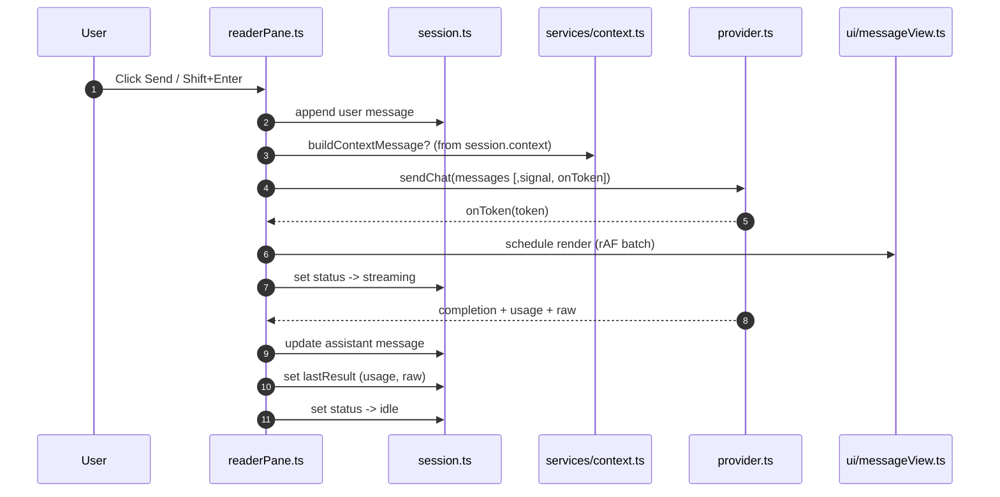
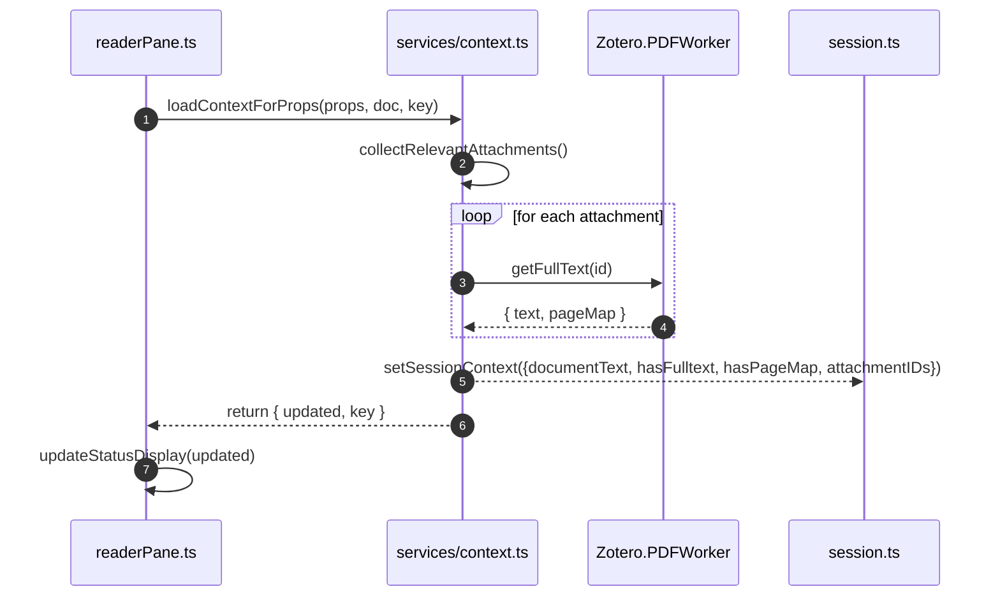

# Architecture Overview

This project is a Zotero 7 plugin that adds an AI chat pane to the Reader/Item side panel. It is implemented in TypeScript and organized into clear layers: UI (DOM + CSS), Services (imperative integrations with Zotero APIs), Core (rendering, session/state), and Integration (provider and presets). This document explains the main components, data flow, and extension points.

## Runtime Targets

- Runtime: Zotero 7 (Firefox platform)
- Language: TypeScript 5.x
- Toolkit: `zotero-plugin-toolkit`, `zotero-types`
- Built‑ins used: `fetch`, `AbortController`, Streams API

## High‑Level Structure

- UI Layer
  - `src/modules/aiChat/readerPane.ts`: Registers the Item Pane section, binds lifecycle hooks, coordinates state and services, and wires DOM to events.
  - `src/modules/aiChat/ui/messageView.ts`: Message list view. Creates message entries, renders content, shows math errors, injects inline citation buttons, and batches re-renders via `requestAnimationFrame`.
  - `src/modules/aiChat/ui/styles.ts`: Injects chat and KaTeX styles into a provided mount (Document or ShadowRoot) with `<link>` tags; no CDN fallbacks.
  - CSS: `addon/content/ai-chat.css` contains all visual styling for the pane and its sub-elements.

- Services Layer
  - `src/modules/aiChat/services/context.ts`: Collects relevant attachments for the current scope, reads full text via `Zotero.PDFWorker.getFullText`, sets session context, and builds a synthetic system message with document text.
  - `src/modules/aiChat/services/readerNav.ts`: Integrates with Zotero Reader. Opens attachments, waits for PDF viewer readiness, navigates to pages, and triggers text find/highlight.
  - `src/modules/aiChat/services/sessionOps.ts`: Computes the session ID and scope key, and resolves/ensures a scoped session.
  - `src/modules/aiChat/services/clipboard.ts`: Robust clipboard copy with progressive enhancement (Clipboard API → Zotero utilities → `execCommand` fallback).

- Core Rendering & Sanitization
  - `src/modules/aiChat/render.ts`: Renders Markdown blocks and inline tokens to DOM, calls math typesetting, and returns sanitized `DocumentFragment` + flags.
  - `src/modules/aiChat/markdown.ts`: Markdown + math tokenization (including inline/block math).
  - `src/modules/aiChat/math.ts`: KaTeX integration (server-side string to HTML); no DOM coupling.
  - `src/modules/aiChat/sanitize.ts`: Sanitizes generated HTML fragments to protect the UI and restricts links.

- State & Provider
  - `src/modules/aiChat/session.ts`: In-memory session store by `sessionId` and `scopeKey`. Tracks messages, context, last result, and status (`idle/sending/streaming/stopped`).
  - `src/modules/aiChat/provider.ts`: Provider abstraction for sending chat completions, streaming tokens, errors, and usage. Raises `ProviderError` with standardized codes.
  - `src/modules/aiChat/providersRegistry.ts`: Built-in presets of provider+model combinations plus helpers to look up the current preset.
  - `src/modules/aiChat/prefs.ts`: Reads/writes plugin preferences (selected preset, API key, endpoints, validation).

- Localization
  - `src/utils/locale.ts`: Fluent-based localization helpers (`getString`, `getLocaleID`, `initLocale`).
  - FTL files: `addon/locale/*/*.ftl`.

## Key Flows

- Pane Lifecycle (Item Pane Section)
  1. Registration via `Zotero.ItemPaneManager.registerSection` creates the AI Chat pane with `onInit`, `onRender`, `onAsyncRender`, `onItemChange`, `onDestroy`.
  2. `readerPane.ts` constructs the UI (status, error, message list, input, preset select) and attaches handlers. All styling is applied through CSS classes.
  3. A Shadow DOM is attached to the pane body; `ensurePaneStyles()` injects `ai-chat.css` and KaTeX CSS into that ShadowRoot.

- Session & Scope Resolution
  - `resolveSessionAndScope()` computes `sessionId` and `scopeKey` based on the current tab/item context and ensures a scoped session. The controller resets UI state when either changes.

- Context Loading
  - `loadContextForProps()` finds relevant PDF attachments for the current scope, reads full text with `Zotero.PDFWorker.getFullText`, and sets `session.context` (presence, pageMap flag, and concatenated text). A derived system message is built on demand.
  - A content key (sorted attachment IDs) avoids redundant reloads.

- Message Send & Streaming
  1. User enters text; controller appends a user message to the session.
  2. Builds provider messages: optional system context + session messages.
  3. Appends an empty assistant message; streams tokens into it via `sendChat` callback, batching DOM updates with `requestAnimationFrame`.
  4. On completion, sets final content, usage, raw payload, and transitions status from `sending → streaming → idle`.
  5. Abort: uses `AbortController` to stop streaming; status becomes `stopped` and partial assistant message may be discarded when empty.

- Rendering Pipeline
  - `renderMessage()` parses Markdown, renders math with KaTeX, sanitizes output, and returns a fragment to be mounted by `MessageView`.
  - Math errors are signaled by a message-level banner (`.ai-chat-message-math-error`).

- Inline Citations
  - `MessageView` scans rendered text nodes for markers like `((cite: ...))` or full‑width equivalents, parses JSON payloads, and injects numbered buttons inline.
  - Click/Enter on a button calls `openReaderAndNavigate()` to open the PDF, navigate to the target page, and try highlighting the quoted text.
  - Any code blocks containing raw citations JSON are hidden via a CSS utility class.

- Clipboard Copy
  - Copy button on assistant messages calls `copyText()`, preferring the Clipboard API, then Zotero internal copy, with a final `execCommand` fallback using an invisible textarea.

## State Management

- `session.ts` holds ephemeral state per `sessionId` and `scopeKey`:
  - `messages`: ordered list of `{ id, role, content, timestamp }`.
  - `context`: `{ hasFulltext, hasPageMap, documentText?, attachmentIDs }`.
  - `status`: one of `idle | sending | streaming | stopped`.
  - `lastResult`: provider metadata (text, usage, raw).

## Styling

- All visual rules live in `addon/content/ai-chat.css`. The controller and view attach semantic classes only.
- Style injection happens per pane ShadowRoot via `ensurePaneStyles()` using `<link>` tags. No CDN fallbacks; all assets are local and scoped to the pane.

## Error Handling & Logging

- Provider failures raise `ProviderError` with `code`, `status`, and i18n-able `messageKey`.
- Network/abort logic flows through `AbortController` and status transitions.
- Non-fatal UI/DOM issues are logged via `ztoolkit.log`.
- Math typesetting errors degrade gracefully by showing raw math text with a banner.

## Build & Packaging

- `npm run build`: copies KaTeX assets (prebuild step) and bundles + type-checks.
- Bundling/packaging is handled by `zotero-plugin` scripts and `zotero-plugin-toolkit` scaffolding.
- Assets:
  - `addon/content/ai-chat.css` (pane styles)
  - `addon/content/vendor/katex.min.css` + fonts (copied during build)

## Directory Guide

- UI & Controller
  - `src/modules/aiChat/readerPane.ts`
  - `src/modules/aiChat/ui/messageView.ts`
  - `src/modules/aiChat/ui/styles.ts`

- Services
  - `src/modules/aiChat/services/context.ts`
  - `src/modules/aiChat/services/readerNav.ts`
  - `src/modules/aiChat/services/sessionOps.ts`
  - `src/modules/aiChat/services/clipboard.ts`

- Core Rendering & State
  - `src/modules/aiChat/render.ts`
  - `src/modules/aiChat/markdown.ts`
  - `src/modules/aiChat/math.ts`
  - `src/modules/aiChat/sanitize.ts`
  - `src/modules/aiChat/session.ts`

- Provider & Preferences
  - `src/modules/aiChat/provider.ts`
  - `src/modules/aiChat/providersRegistry.ts`
  - `src/modules/aiChat/prefs.ts`

- Localization & Assets
  - `src/utils/locale.ts`
  - `addon/locale/*/*.ftl`
  - `addon/content` (CSS, icons, vendor)

## Extensibility

- Providers: Add new presets to `providersRegistry.ts` or implement new provider behaviors in `provider.ts` (e.g., new endpoints or auth mechanisms).
- UI: Extend `MessageView` for new per-message actions or formatting, preserving the sanitize → render → mount flow.
- Context: Customize `collectRelevantAttachments()` and `readAttachmentsContext()` for other attachment types or alternate preprocessing.
- Localization: Add keys to FTL files and use `getString()`/`getLocaleID()` to reference them.

## Conventions

- Keep controller thin by delegating UI details to `ui/*` and integrations to `services/*`.
- Render-only modules (`render.ts`, `math.ts`, `markdown.ts`) should remain pure and not depend on Zotero DOM APIs.
- Favor `hidden`/class toggles over inline styles; keep all styling in CSS.

## Diagrams

### Component Map

```mermaid
graph TD
  subgraph UI
    A[readerPane.ts<br/>(Controller)] --> B[ui/messageView.ts]
    A --> STY[ui/styles.ts]
  end

  subgraph Services
    A --> C[services/sessionOps.ts]
    A --> D[services/context.ts]
    A --> E[services/readerNav.ts]
    A --> F[services/clipboard.ts]
  end

  subgraph Core
    B --> R[render.ts]
    R --> M[math.ts]
    R --> MK[markdown.ts]
    R --> S[sanitize.ts]
    A --> SE[session.ts]
  end

  subgraph Provider
    A --> P[provider.ts]
    P --> PR[providersRegistry.ts]
  end

  A --> L[utils/locale.ts]
  STY -. inject .-> CSS[addon/content/ai-chat.css]
```

### Key Flows

Message send and streaming:



Context loading:


